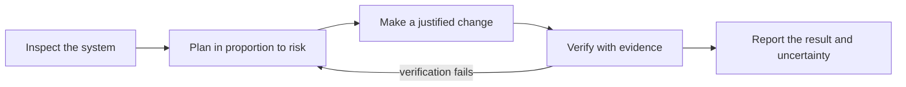
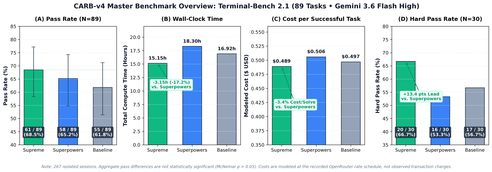
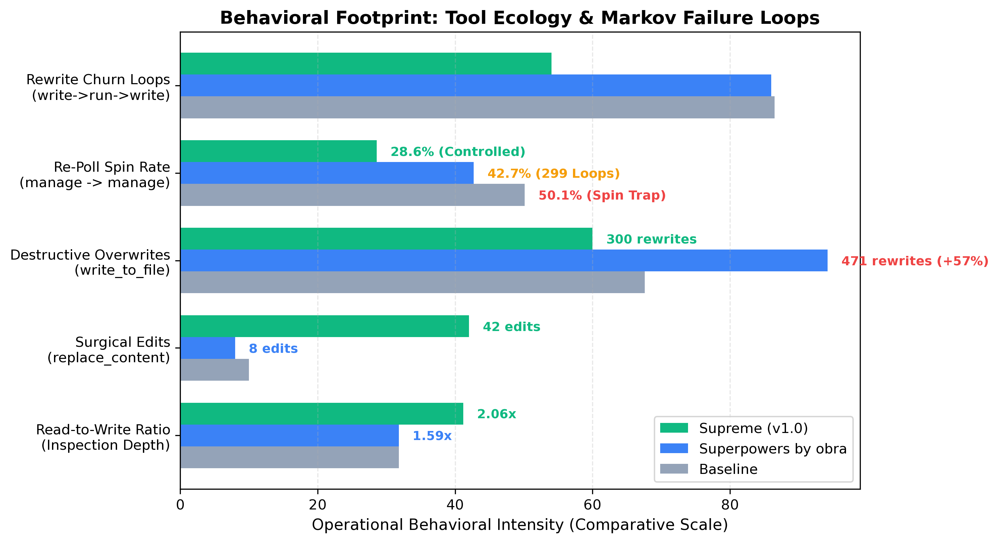

<p align="center">
  
</p>

<h3 align="center">For agents that should know better.</h3>

<p align="center">
  <em>A lean engineering skill and constitution. Plain Markdown, with no runtime or dependencies.</em>
</p>

<p align="center">
  <strong>Five Guidance Modules</strong> &nbsp;&bull;&nbsp;
  <strong>Portable Agent Skill</strong> &nbsp;&bull;&nbsp;
  <strong>Zero Runtime</strong> &nbsp;&bull;&nbsp;
  <strong>Terminal-Bench 2.1 · 267 Graded Runs</strong> &nbsp;&bull;&nbsp;
  <strong>MIT License</strong>
</p>

<p align="center">
  <a href="#install-the-supreme-skill"><strong>Get Supreme</strong></a> &nbsp;&bull;&nbsp;
  <a href="https://huggingface.co/datasets/Utkarsh-X/Supreme/blob/main/Supreme_Paper.pdf"><strong>Read the research paper</strong></a> &nbsp;&bull;&nbsp;
  <a href="#start-here-make-it-yours">Start using Supreme</a> &nbsp;&bull;&nbsp;
  <a href="#the-receipt-89-tasks-267-container-runs">Explore the evaluation</a>
</p>

---

You ask an agent to fix an off-by-one error in a parser.

It inspects nothing. It rewrites three files from scratch, wipes out your error handling, runs `ls -la` twenty times, launches background compilation loops it forgets about, and then proudly announces:

> *"Task complete! I have improved your architecture and verified everything works."*

It did not run the test suite. It did not check the exit code. It simply declared victory and went to sleep.

Every developer using agents has been there. Agents do not fail because they lack intelligence—they fail because they lack basic engineering discipline. When left unconstrained, they guess instead of investigating, rewrite entire files to tweak one line, spin in infinite polling loops, and declare tasks finished without checking.

**Supreme** gives your agent an engineering constitution: evidence instead of panic, surgical line diffs instead of file overwrites, verification instead of victory laps.

---

## What Supreme Actually Is

**Five guidance modules, one portable skill.** Supreme is an engineering skill for coding agents working in existing software projects. Its five full documents cover the constitution, operating protocol, specialist roles, environment profile, and persistent state. The [portable Agent Skill](skills/supreme/SKILL.md) is the entrypoint and instructs the agent to read all five documents before work begins. For always-on project instructions, use the complete [single-file guide](supreme.md). Neither needs a runtime or hooks.

The paper documents the evaluated configuration and provides detailed token accounting, including the limitations of cache-read comparisons. It remains the source for the study's methods and measured results.

Supreme is both an engineering skill and the subject of an evaluation study. This repository publishes the skill documents and research results; it is not a released benchmark framework or evaluation pipeline.

---

## Why Terminal-Bench 2.1?

**All 89 tasks. No hand-picked subset. 267 isolated runs.**

Terminal-Bench 2.1 is a benchmark suite for evaluating model-driven agents on terminal tasks. We chose its complete 89-task set instead of building a small task list ourselves, so we would not select tasks around Supreme's results. Each of the three configurations ran every task once. The paper also groups results by task category, giving readers more than a single overall score.

---

## Install the Supreme Skill

Supreme requires zero dependencies, runtimes, or background hooks. Choose the setup that fits your workflow:

### 1. Tell Your Agent (Zero-Terminal Setup)

Copy and paste this prompt directly into your coding agent (Claude Code, Cursor, Codex, OpenCode):

```text
Install the Supreme skill from https://github.com/Utkarsh-X/Supreme:

1. Detect your current host environment and install the skill in its documented native Agent Skills directory. Prefer the global/user-level location unless a project-local installation is explicitly requested.
2. Install it under `supreme/`, including `SKILL.md` and all five files in `references/`: `constitution.md`, `operating-protocol.md`, `sub-agent-profiles.md`, `environment-profile.md`, and `persistent-state.md`.
3. Verify that all six files exist, are non-empty, and are readable, and that `SKILL.md` references the five expected files at their relative paths. Confirm when ready.
```

### 2. Terminal Installation

The Agent Skills package contains `SKILL.md` and the five complete guidance documents under `references/`. The commands download only those skill files; they do not clone the repository or download the paper or evaluation pipeline.

```text
skills/supreme/
├── SKILL.md
└── references/
    ├── constitution.md
    ├── operating-protocol.md
    ├── sub-agent-profiles.md
    ├── environment-profile.md
    └── persistent-state.md
```

**macOS / Linux (Bash):**
```bash
set -e
skill_root="${SKILL_ROOT:-$HOME/.agents/skills}" # See table below for agent paths
skill_dir="$skill_root/supreme"
base_url="https://raw.githubusercontent.com/Utkarsh-X/Supreme/main/skills/supreme"
mkdir -p "$skill_dir/references"
curl -fsSL "$base_url/SKILL.md" -o "$skill_dir/SKILL.md"
for file in constitution.md operating-protocol.md sub-agent-profiles.md environment-profile.md persistent-state.md; do
  curl -fsSL "$base_url/references/$file" -o "$skill_dir/references/$file"
done
```

**Windows (PowerShell):**
```powershell
$skillRoot = if ($env:SKILL_ROOT) { $env:SKILL_ROOT } else { Join-Path $HOME ".agents\skills" } # See table below for agent paths
$skillDir = Join-Path $skillRoot "supreme"
$baseUrl = "https://raw.githubusercontent.com/Utkarsh-X/Supreme/main/skills/supreme"
$ErrorActionPreference = "Stop"
New-Item -ItemType Directory -Force -Path (Join-Path $skillDir "references") | Out-Null
Invoke-WebRequest -Uri "$baseUrl/SKILL.md" -OutFile (Join-Path $skillDir "SKILL.md")
$modules = @("constitution.md", "operating-protocol.md", "sub-agent-profiles.md", "environment-profile.md", "persistent-state.md")
foreach ($file in $modules) {
  Invoke-WebRequest -Uri "$baseUrl/references/$file" -OutFile (Join-Path $skillDir "references\$file")
}
```

#### Skills Root Directory by Host

| Agent | Global skills root (`skill_root`) |
|---|---|
| [Codex](https://developers.openai.com/codex/skills), [Cursor](https://prod.cursor.com/docs/skills), [Gemini CLI](https://github.com/google-gemini/gemini-cli/blob/main/docs/cli/using-agent-skills.md), [OpenCode](https://dev.opencode.ai/docs/skills/), [Zed](https://zed.dev/docs/ai/skills) | `~/.agents/skills/` |
| [Claude Code](https://code.claude.com/docs/en/skills) | `~/.claude/skills/` |
| [Cline](https://docs.cline.bot/customization/skills) | `~/.cline/skills/` |
| [Antigravity IDE / 2.0](https://www.antigravity.google/docs/skills) | `~/.gemini/config/skills/` |
| [Antigravity CLI](https://www.antigravity.google/docs/skills) | `~/.gemini/antigravity-cli/skills/` |

For Claude Code, set `skill_root` to `"$HOME/.claude/skills"`; for Cline, use `"$HOME/.cline/skills"`. For Antigravity, use the matching path in the table or put the skill in your workspace's `.agents/skills/supreme/` directory.

### 3. Single-File Drop-In (`supreme.md`)

For agents or workflows that do not use multi-file skills, use [`supreme.md`](supreme.md) as a complete, always-on instruction file:
- `AGENTS.md` &mdash; supported by many coding agents, including Codex, Cursor, and OpenCode
- `CLAUDE.md` &mdash; Claude Code project instructions
- `.cursor/rules/` &mdash; Cursor project rules (`.cursorrules` supported for legacy compatibility)
- Custom system or developer prompts

**macOS / Linux:**
```bash
curl -fsSL https://raw.githubusercontent.com/Utkarsh-X/Supreme/main/supreme.md -o supreme.md
```

**Windows (PowerShell):**
```powershell
Invoke-WebRequest -Uri "https://raw.githubusercontent.com/Utkarsh-X/Supreme/main/supreme.md" -OutFile "supreme.md"
```

After installing, choose Supreme from your agent's skills menu or invoke it using that agent's skill command. For Claude on the web or desktop, zip the entire `supreme` folder with that folder at the ZIP's root, then upload it through Claude's Skills interface.

---

## Start Here. Make It Yours.

The standard reaction to an agent making mistakes is to pile on more: fifty-page operating manuals, orchestration frameworks, thousands of lines of procedural instructions. The result drowns in its own context and becomes slower and more confused.

Supreme goes the other way: **nine principles, one operating protocol, five files.** If you remember nothing else, the nine distill into four instincts:

1. **Evidence over assumption** &mdash; Read the file. Run the compiler. Look at the stack trace. Never guess when the environment can tell you the truth.
2. **Surgical diffs** &mdash; Touch only what is broken. If you are fixing line 42, leave lines 1&ndash;41 and 43&ndash;400 completely untouched.
3. **Proactive loop breaking** &mdash; If a command stalls or an approach fails twice, stop. Do not spin in polling loops or retry the exact same failing command.
4. **Proof mandatory** &mdash; Code generated is not task complete. Tests passing is not system correct. Prove it works before claiming it is done.

Start here. Treat this as your baseline. Understand what your workflow actually requires, prune what you do not need, and make it your own.

The working loop is simple: understand the system, choose an approach proportionate to risk, make a justified change, verify it, and report what the evidence supports.



---

## The Behavioral Contrast

| The Unconstrained Trap | The Supreme Grounding |
|---|---|
| **Whole-File Blast Radius**: Overwrites hundreds of lines of working code to modify a single boolean, risking silent regressions and obscuring the change. | **Surgical Line Diffs**: Prefers targeted line replacements. If you are fixing line 42, the rest of the file stays untouched. |
| **The Polling Spin Trap**: Launches background tasks and repeatedly polls status hundreds of times without doing any meaningful work. | **Proactive Loop Breaking**: Detects stalling early, checks exit codes immediately, and halts circular tool loops. |
| **Trial-and-Error Scripting**: On Task 88, the successful Superpowers run authored 116 exploration scripts and used 3,513,757 tokens. | **Hypothesis-Driven Deliberation**: On the same task, the successful Supreme run used 55 turns and 300,413 tokens. Both runs passed; this is a case study, not a general efficiency ranking. |
| **Premature Victory**: Assumes that because code was generated without a syntax crash, the task is complete. | **Proof Mandatory**: Code generated &ne; task complete. Tests passing &ne; system correct. Explicit verification evidence is required. |

---

## Three Runs That Explain the Whole Benchmark

Three examples documented in the [research paper](https://huggingface.co/datasets/Utkarsh-X/Supreme/blob/main/Supreme_Paper.pdf) make the benchmark behavior concrete. They describe particular runs and are not, by themselves, proof that one instruction caused an overall result.

**Same task, same model, same arena.** On Task 88 (Core Wars), Supreme inspected reference warriors, formed a Silk/Replicator hypothesis, implemented a candidate, and verified its win rates. The successful run took **175.0 seconds, 55 turns, and 300,413 tokens**. Superpowers also passed; its run authored **116 exploration scripts** and took **1,648.7 seconds, 563 turns, and 3,513,757 tokens**. This is a case study of two runs, not a general efficiency ranking.

**44 minutes, nobody watching.** Windows 3.11 for Workgroups, installed autonomously inside headless QEMU—disks partitioned, FAT16 formatted, floppy images swapped, network drivers installed. **307 turns.** It finished.

**The polling gap.** When asynchronous background commands were active, the unprompted Baseline immediately re-polled in **50.1%** of transitions, Superpowers in **42.7%**, and Supreme in **28.6%**. These are configuration-level observations; they do not isolate the effect of a single guidance rule.

---

## The Receipt: 89 Tasks, 267 Container Runs

We did not write these rules because they sound nice on paper. We wanted to see how an agent guided by Supreme performed in real terminal environments against another guidance system and an unprompted baseline.

We evaluated Supreme against an unprompted **Baseline** and the dynamic skill system **Superpowers by obra** across all 89 tasks of **Terminal-Bench 2.1**: 267 isolated container runs, one run per task for each configuration. All configurations used **Gemini 3.6 Flash High through Google's API**, with **Claude Code as the execution client** and temperature set to **0.0**:

| Metric | Supreme (v1.0) | Superpowers by obra | Baseline (Unprompted) | Comparison |
|---|:---:|:---:|:---:|---|
| **Tasks Solved (N=89)** | **61 / 89 (68.5%)** | 58 / 89 (65.2%) | 55 / 89 (61.8%) | Highest completion: +3 vs Superpowers, +6 vs Baseline |
| **Adjusted Pass Rate\*** | **70.9%** (61/86) | 67.4% (58/86) | 64.0% (55/86) | Adjusted for 3 upstream container defects |
| **Hard Tasks (N=30)** | **20 / 30 (66.7%)** | 16 / 30 (53.3%) | 17 / 30 (56.7%) | +13.4 pts over dynamic skill loading (p = 0.22, directional) |
| **Aggregate Wall-Clock Time** | **15.15 h** | 18.30 h | 16.92 h | 17.2% less aggregate time than Superpowers |
| **Cost / Solved Task** | **$0.489** | $0.506 | $0.497 | Lowest modeled cost per successful solution |
| **Targeted Line Replacements** | **42** | 9 | &mdash; | Superpowers also recorded 471 full-file overwrites |
| **Recorded Input + Output Tokens** | 34.52 M | 33.95 M | **30.87 M** | Baseline recorded the fewest total tokens and solved the fewest tasks |
| **Tokens / Successful Task** | 565,925 | 585,414 | **561,234** | Baseline had the fewest recorded tokens per successful task |
| **Avg Time / Task** | **612.9 s** | 740.2 s | 684.3 s | 17.2% faster per task than Superpowers |

<sub>Note: Aggregate completion-rate differences were not statistically significant under paired McNemar tests (all p > 0.05). Adjusted rates exclude three verified upstream environment defects. Cost figures are estimates under recorded OpenRouter rates, not reported transaction charges.</sub>

<p align="center">
  
</p>

### Master Scoreboard (89 Tasks &times; 3 Paradigms = 267 Evaluated Runs)

| Configuration | Raw Pass (N=89) | Raw Pass (95% CI) | Adjusted Pass (N=86)* | Aggregate Wall-Clock Time | Mean Deliberation Tokens on Hard Tasks (N=30) |
|---|:---:|:---:|:---:|:---:|:---:|
| **Supreme (v1.0)** | **61 / 89** | **68.5%** [58.3%, 77.2%] | **70.9%** [60.6%, 79.5%] | **15.15 h** | **28,271** |
| Superpowers by obra | 58 / 89 | 65.2% [54.8%, 74.3%] | 67.4% [57.0%, 76.4%] | 18.30 h | 23,196 |
| Baseline (Unprompted) | 55 / 89 | 61.8% [51.4%, 71.2%] | 64.0% [53.4%, 73.3%] | 16.92 h | 24,426 |

<sub>*Adjusted scores exclude three tasks with verified upstream container defects (<code>prove-plus-comm</code>, <code>caffe-cifar-10</code>, <code>torch-pipeline-parallelism</code>). Brackets report Wilson 95% score confidence intervals.</sub>

*One model, one run per task and configuration, temperature zero. Paired McNemar tests did not distinguish aggregate completion rates (all p > 0.05); the Hard-task difference is directional (p = 0.22). Because each task/configuration was run once, this evaluation does not measure repeat-run variability. The behavior measures below are configuration-level observations, not isolated causal effects.*

<p align="center">
  
</p>

### What the Data Actually Showed

1. **Deliberation on Hard Tasks**: Supreme's mean provider-reported deliberation was **28,271 tokens per Hard task**, compared with **17,035 on Medium tasks** (+66%). On Hard tasks Supreme passed 20/30, compared with 16/30 for Superpowers and 17/30 for Baseline. The paired result is directional (McNemar p = 0.22); it does not establish that deliberation caused the difference in task outcomes.
2. **Evaluated Unit Economics**: Supreme had the lowest modeled cost per successful task (**$0.489**), about **3.4% below Superpowers ($0.506)**. Baseline had the lowest modeled total cost ($27.33) and cost per attempt ($0.307), while completing fewer tasks. These are rate-based estimates, not transaction charges; token totals and cost per successful task measure different things.
3. **Surgical Editing in Practice**: Supreme used 42 targeted line replacements, compared with 9 for Superpowers. Superpowers also recorded 471 full-file overwrites. Across tasks, Supreme modified a mean of 2.60 unique files per task versus 3.79 for Superpowers; these are configuration-level patterns, not proof that one editing tool caused the difference.
4. **Escaping the Polling Spin Trap**: When asynchronous background commands were active, immediate re-polling was observed in 50.1% of Baseline transitions, 42.7% of Superpowers transitions, and 28.6% of Supreme transitions. Superpowers logged 299 triple-polling sequences. These observations do not isolate the effect of any single guidance rule.
<details>
<summary><strong>How we measured—and what we'd do differently</strong></summary>

Earlier CARB-v2 and CARB-v3 pilots used smaller task sets and left the performance gap uncertain. That led us to evaluate the complete, unmodified 89-task Terminal-Bench 2.1 suite rather than select tasks around the result.

Known limits, stated plainly: one foundation model (Gemini 3.6 Flash High through Google's API, with Claude Code as execution client), one run per task/configuration, and structure confounded with content—Supreme and Superpowers differ in delivery mechanism <em>and</em> in what they teach. The paper identifies multi-model replication and controlled ablations as future work.

Three tasks with verified upstream container defects (<code>prove-plus-comm</code>, <code>caffe-cifar-10</code>, <code>torch-pipeline-parallelism</code>) are excluded from the adjusted cohort (N = 86); a fourth (<code>torch-tensor-parallelism</code>) is additionally excluded in the conservative cohort (N = 85).

</details>

---

## The Constitution in Practice

The complete engineering constitution lives in [`SupremeAgent/constitution.md`](SupremeAgent/constitution.md): **nine invariant principles**, from *Evidence Over Assumption* to *Consequential Actions Require Proportional Accountability*, plus six named anti-patterns (*progress theater*, *assumption cascade*, *scope explosion*&hellip;).

The [operating protocol](SupremeAgent/operating-protocol.md) carries the machinery: risk-scaled planning, failure classification (CODE / ENVIRONMENT / TOOL / EXTERNAL / UNKNOWN), and loop management—the source of instinct #3 above. It ends with the best rule in the file:

> **"BLOCK is a valid, successful outcome. It is better than guessing."**

---

## Use Supreme with Your Agent

Choose the loading style that fits your work:

- **On-demand skill:** Install `SKILL.md` in the host directory above, then select it from the skill menu, invoke it by name, or let the agent load it when relevant.
- **Always-on project guidance:** Use the complete [single-file guide](supreme.md) as the persistent instruction file your host reads for the project. This keeps Supreme present across coding tasks instead of loading it as a skill when needed.

The benchmark used Claude Code as the execution client. The other host paths are ways to install and use Supreme; the paper reports the study's measured configuration and results.

---

## Research Paper and Release Scope

The [research paper](https://huggingface.co/datasets/Utkarsh-X/Supreme/blob/main/Supreme_Paper.pdf) documents the evaluation method, score definitions, aggregate results, confidence intervals, paired statistical tests, token accounting, cost estimates, case studies, and limitations. It is the detailed account behind the results summarized here.

This release publishes the skill documents, research paper, and reported findings. It does not include the task corpus, run-level traces, or the full evaluation pipeline. Readers can study the method and reported evidence in the paper and conduct their own evaluation.

---

## Part 1 of a Two-Part Evaluation

This release is Part 1: a full 89-task comparison of Supreme, Superpowers, and an unprompted baseline. In Part 2, I plan to improve Supreme and compare it with additional coding-agent skills. I will report the results whether or not they favor Supreme; the goal is to learn where the skill helps and where it still needs work.

**Follow along for project updates on X:** [@utk0x](https://x.com/utk0x).

---

## FAQ

**Is this a framework?**
No. Supreme is an engineering skill expressed in five Markdown documents. There is no runtime to build, import, or update.

**Does it work with other models?**
Untested. The benchmark locked one model at temperature zero. The constitution is model-agnostic prose—if you run it elsewhere, you now know exactly how to measure it.

**Why not just write my own rules?**
You should. Supreme is a benchmarked starting point, not a rulebook you have to follow exactly. Adapt it to your workflow; the published results give you a tested baseline to build from.

**Why "Supreme"?**
Because somewhere between *please be careful* and *verify everything*, the agent needed to hear it from an authority.

---

## Why I Built Supreme

I'm a perfectionist about the tools I rely on: I want evidence before I trust them with my work. I built Supreme for my own development after finding that agent workflows could add more process, context, and back-and-forth than a task needed. I wanted the useful discipline—investigate first, plan to the risk, change only what is justified, and verify the result—without letting procedure distract from the developer's goal. So I evaluated Supreme across the full Terminal-Bench 2.1 suite before sharing it.

---

## License

[MIT](LICENSE). The constitution is yours to amend.
