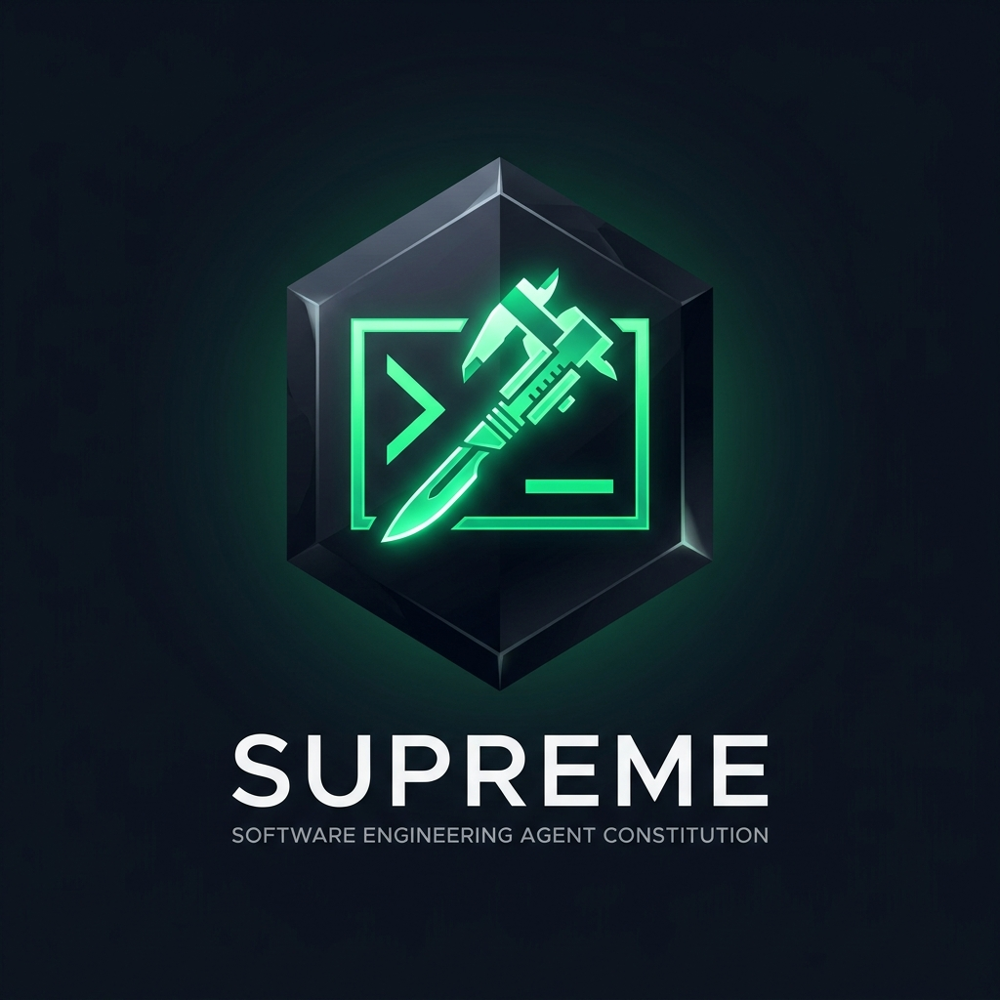
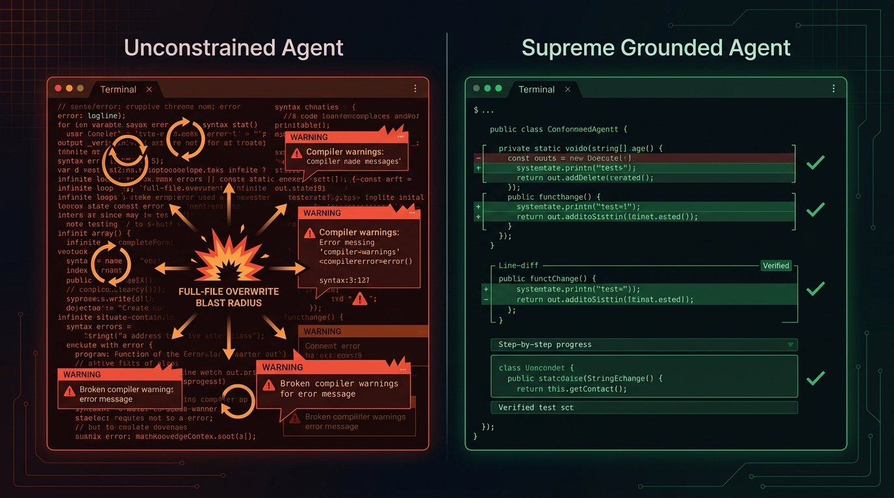

<p align="center">
  
</p>

<h1 align="center">Supreme</h1>

<p align="center">
  <em>Evidence over assumption. Surgical changes over code churn. Proof before declarations.</em>
</p>

<p align="center">
  
  
  
  
  
</p>

---

<p align="center">
  
</p>

You ask an autonomous coding agent to fix an off-by-one error in a parser.

It inspects nothing. It rewrites three entire files, wipes out half of your error handling, spawns fourteen background compilation loops while checking `ls -la` twenty times, and proudly announces:

> *"Task complete! I have improved your architecture and verified everything works."*

It did not run the test suite. It did not check the compiler exit code. It has simply declared victory and gone to sleep.

**Supreme** puts an unshakeable engineering constitution inside your agent. It replaces speculative panic with evidence-based deliberation, full-file overwrites with surgical line diffs, and unearned "done" declarations with concrete verification proofs.

---

## ⚡ The Behavioral Contrast

| The Unconstrained Trap | The Supreme Grounding |
|---|---|
| **Whole-File Blast Radius**: Overwrites 400 lines of existing code to alter a single boolean, introducing silent regressions and breaking git history. | **Surgical Diff Boundaries**: Enforces minimal line modifications (`replace_file_content`). If you're fixing line 42, lines 1–41 and 43–400 remain untouched. |
| **The Polling Spin Trap**: Fires asynchronous commands and re-polls `manage_task` 299 times in an infinite wait loop without doing useful work. | **Proactive Loop-Breaking**: Enforces loop-management protocols. Identifies stalled states early, checks exit status, and breaks out. |
| **Trial-and-Error Scripting**: Authors 116 separate disposable Python scripts on combinatorial problems, exhausting context and inflating token costs 11.7×. | **Hypothesis-Driven Deliberation**: Forms a domain-grounded hypothesis before execution. Solves the same benchmark problem in 55 turns and 300k tokens. |
| **Premature Completion**: Assumes that because code was generated without a syntax crash, the underlying bug is resolved. | **Completion Requires Evidence**: Code generated $\neq$ task complete. Tests passing $\neq$ system correct. Explicit verification proof is mandatory. |

---

## 📊 The Empirical Evidence: Terminal-Bench 2.1

We evaluated Supreme against an unprompted **Baseline** and the dynamic skill system **Superpowers by obra** across all 89 tasks of **Terminal-Bench 2.1** (267 containerized executions) under locked **Gemini 3.6 Flash High** ($\tau = 0.0$):

```
┌────────────────────────────────────────────────────────────────────────────────────────┐
│             SAME BENCHMARK. THREE CONFIGURATIONS. DIFFERENT EXECUTION ECONOMICS.       │
│                                (Terminal-Bench 2.1 • N=89 Tasks)                       │
├─────────────────────────┬──────────────────────────┬───────────────────────────────────┤
│ 🏆 TASKS SOLVED         │ ⚡ AGGREGATE RUNTIME     │ 💰 COST / SUCCESSFUL TASK         │
│                         │                          │                                   │
│ Supreme:     61 / 89    │ Supreme:     15.15 Hours │ Supreme:     $0.489  [-3.4%]      │
│ Superpowers: 58 / 89    │ Superpowers: 18.30 Hours │ Superpowers: $0.506              │
│ Baseline:    55 / 89    │ Baseline:    16.92 Hours │ Baseline:    $0.497              │
│                         │                          │                                   │
│ Highest observed solve  │ 17.2% lower aggregate    │ Lowest modeled cost per           │
│ rate (68.5%)            │ runtime than Superpowers │ successful solution               │
├─────────────────────────┴──────────────────────────┴───────────────────────────────────┤
│ 🧠 HARD TASK FRONTIER (N=30)                       🛡️ CODE MODIFICATION PRECISION     │
│                                                    │                                   │
│ Supreme:     20 / 30 (66.7%)  [+13.4 pts]          │ Supreme:     42 Surgical Edits    │
│ Superpowers: 16 / 30 (53.3%)                       │ Superpowers:  8 Surgical Edits    │
│ Baseline:    17 / 30 (56.7%)                       │ (300 vs. 471 whole-file rewrites) │
├────────────────────────────────────────────────────────────────────────────────────────┤
│ Note: Aggregate pass rate differences are not statistically significant (McNemar p>0.05).│
│ Evaluated on Gemini 3.6 Flash High. Economic figures modeled on OpenRouter paid rates. │
└────────────────────────────────────────────────────────────────────────────────────────┘
```

<p align="center">
  
</p>

### Master Scoreboard (89 Tasks × 3 Paradigms = 267 Evaluated Runs)

| Configuration | Raw Pass (N=89) | Raw Pass (95% CI) | Adjusted Pass (N=86)* | Total Compute Time | Thinking Tokens / Task |
|---|:---:|:---:|:---:|:---:|:---:|
| **Supreme (v1.0)** | **61 / 89** | **68.5%** [58.3%, 77.2%] | **70.9%** [60.6%, 79.5%] | **15.15h** | **18,728** |
| Superpowers by obra | 58 / 89 | 65.2% [54.8%, 74.3%] | 67.4% [57.0%, 76.4%] | 18.30h | 17,617 |
| Baseline (Unprompted) | 55 / 89 | 61.8% [51.4%, 71.2%] | 64.0% [53.4%, 73.3%] | 16.92h | 18,521 |

<sub>*Adjusted scores exclude three tasks with verified upstream container environment defects (`prove-plus-comm`, `caffe-cifar-10`, `torch-pipeline-parallelism`). Brackets report Wilson 95% score confidence intervals.</sub>

<p align="center">
  
</p>

### Key Empirical Takeaways

1. **Deliberation Scaling on Hard Problems**: On the 30 most complex tasks, Supreme unlocked **+66% higher internal deliberation** (28,271 thinking tokens/task vs. 17,035 on Medium), maintaining a 66.7% pass rate (20/30) compared to 53.3% (16/30) for Superpowers and 56.7% (17/30) for Baseline.
2. **Evaluated Unit Economics**: Supreme achieved the lowest modeled cost per successful task (**$0.489** paid), approximately **3.4% below Superpowers ($0.506)**, while completing three additional tasks (61 vs. 58). In absolute spend, Baseline spent the least ($27.33 paid) and achieved the lowest cost per attempt ($0.307).
3. **3.8× Fewer Destructive Rewrites**: Supreme performed 42 targeted surgical line replacements versus only 8 for Superpowers, cutting full-file overwrites from 471 down to 300.
4. **Escaping the Polling Spin Trap**: While Baseline fell into the command-polling spin trap 50.1% of the time and Superpowers logged 299 repetitive polling sequences (42.7%), Supreme reduced uninformative polling loops to **28.6%**.
5. **Context Economics**: Ingesting extensive procedural documentation on-demand accumulated **411.3 Million cache read tokens** under Superpowers—an excess of 115.4 Million cache tokens over Baseline. Keeping invariant constitutional axioms in static headers avoids mid-turn documentation file bloat.

---

## 🏛️ The Four Pillars of the Supreme Constitution

```
┌────────────────────────────────────────────────────────┐
│                  THE SUPREME PROTOCOL                  │
├────────────────────────────────────────────────────────┤
│  1. EVIDENCE OVER ASSUMPTION                           │
│     Observe system state before proposing changes.    │
│                                                        │
│  2. SURGICAL DIFF BOUNDARIES                           │
│     Minimum justified change. Never refactor what      │
│     isn't broken.                                      │
│                                                        │
│  3. PROACTIVE LOOP BREAKING                            │
│     Spin traps are failure. Set iteration ceilings.   │
│                                                        │
│  4. COMPLETION REQUIRES EVIDENCE                       │
│     No declaration without concrete test verification. │
└────────────────────────────────────────────────────────┘
```

1. **Evidence Over Assumption**: When uncertainty exists, investigate rather than speculate. Prefer current, verifiable evidence—compiler logs, test runs, file contents—over memory or assumptions.
2. **Surgical Diff Boundaries**: The best diff is the smallest diff that solves the root cause and preserves system integrity. Never rewrite or reformat surrounding code for agent convenience.
3. **Loop-Breaking Discipline**: If an approach fails twice, do not make a third speculative guess without gathering new evidence. Detect and terminate circular tool calls.
4. **Completion Requires Evidence**: A task is complete only when acceptance criteria are verified with concrete evidence. Ask: *"If this were falsely claiming to be complete, what did I overlook?"*

---

## 🚀 Using Supreme (Universal Agent Compatibility)

Supreme operates via thin, portable adapters. It can run as an always-on instruction file or a direct project rule across modern AI coding environments:

### Gemini & Agent Runtimes
Place [`AGENTS.md`](AGENTS.md) in your workspace root, or install as an always-on rule:
```bash
cp SupremeAgent/constitution.md ~/.gemini/rules/supreme.md
```

### Cursor & Windsurf
Add Supreme to your project steering rules:
```bash
# Cursor
cp SupremeAgent/constitution.md .cursor/rules/supreme.mdc

# Windsurf
cp SupremeAgent/constitution.md .windsurf/rules/supreme.md
```

### Claude Code
Add to your project's `CLAUDE.md` or invoke the constitutional framework:
```bash
cat SupremeAgent/constitution.md >> CLAUDE.md
```

### OpenCode, Codex, Devin, Zed & Jules
These environments natively auto-discover [`AGENTS.md`](AGENTS.md) from the repository root with zero configuration required.

---

## 🔬 Scientific Transparency & Replication

This project is released with 100% cryptographic and telemetry transparency:

* 📄 **Research Paper:** [`paper/main.pdf`](paper/main.pdf) — Complete 9-page academic manuscript with full statistical analysis, Wilson CIs, cost economics, and paired McNemar tests.
* 🧾 **Cryptographic Ledger:** [`carb_benchmark/results_v4/FORENSIC_AUDIT_LEDGER.md`](carb_benchmark/results_v4/FORENSIC_AUDIT_LEDGER.md) — Exact SHA-256 verifier logs and execution timestamps for all 267 graded container sessions.
* 📑 **Deep Telemetry Dossiers:** Located in [`carb_benchmark/results_v4/extraction_findings/`](carb_benchmark/results_v4/extraction_findings/) covering Markov transitions, polyglot analysis, thinking dynamics, and token sinks.

---

## 📜 License

[MIT](LICENSE). Released as an open research artifact and developer utility.
